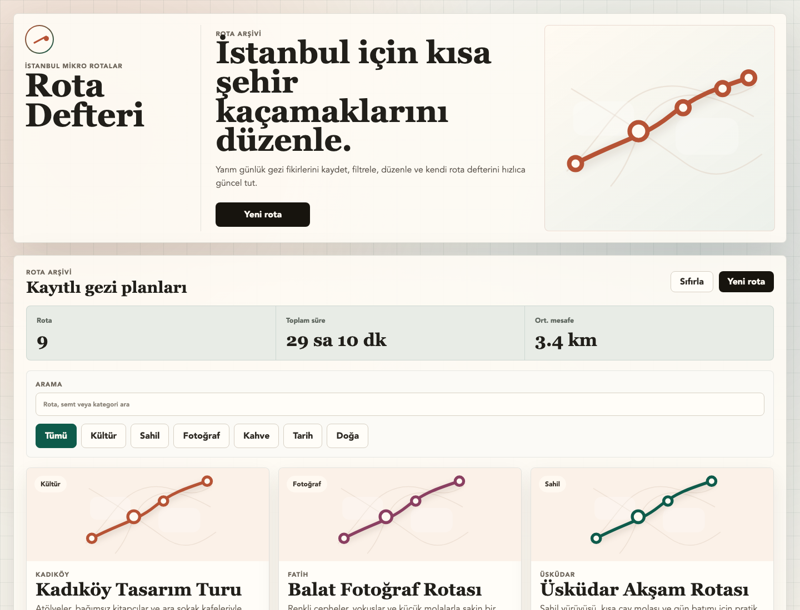

# Rota Defteri Web

İstanbul mikro gezi rotalarını yönetmek için hazırlanmış React tabanlı web uygulaması.

## Özellikler

- Rota ekleme
- Rota listeleme
- Rota güncelleme
- Rota silme
- Kategori filtresi ve arama
- LocalStorage ile kalıcı kayıt
- Responsive arayüz

## Kullanılan Teknolojiler

- React
- TypeScript
- Vite
- Pure CSS
- LocalStorage

## Kurulum

```bash
pnpm install
pnpm dev
```

## Build

```bash
pnpm build
```

## Linkler

- GitHub: https://github.com/Berkecrkmn/rota-defteri-web
- Netlify: https://rota-defteri-web-berke.netlify.app

## Proje Yapısı

```text
src/
  components/
  data/
  interfaces/
  pages/
  utils/
```

## Ekran Görüntüsü



Form teslimi için ek görüntüler:

- `screenshots/form/01_ana_ekran_listeleme.png`
- `screenshots/form/02_yeni_rota_modal.png`
- `screenshots/form/03_yeni_rota_ekleme_sonucu.png`
- `screenshots/form/04_arama_balat_sonucu.png`
- `screenshots/form/05_rota_guncelleme_modal.png`
